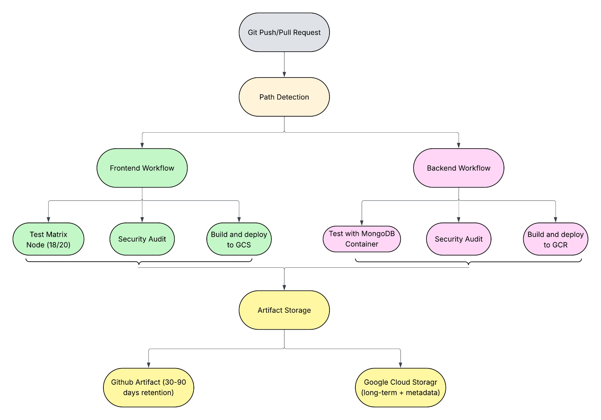

# CI/CD Automation Workflow: Purpose & Functionalities

## Purpose of the Automation Workflows

The Timeless Watch Rental application implements dual CI/CD automation workflows (`frontend-ci-cd.yaml` and `backend-ci-cd.yaml`) that serve three core purposes:

1. **Quality Assurance Automation** - Automatically test code changes across multiple Node.js versions with comprehensive coverage analysis
2. **Deployment Pipeline Automation** - Streamline the build and deployment process from development to production environments
3. **Security and Compliance Automation** - Integrate security auditing and dependency scanning into the development lifecycle

## Workflow Architecture Overview



The automation workflows follow a structured pipeline where **trigger events** (Git push, pull requests, scheduled runs, manual dispatch) initiate either the **Frontend Workflow** or **Backend Workflow** based on file path detection. Each workflow processes through testing matrices, security auditing, building/packaging, and deployment preparation phases, ultimately producing static assets for Google Cloud Storage (frontend) or containers for Cloud Run (backend), along with comprehensive audit reports.

## Core Functionalities

### 1. Multi-Environment Testing Automation

**Purpose**: Ensure code compatibility across different Node.js versions and environments

**Frontend Testing Functionality**:
```yaml
strategy:
  matrix:
    node-version: [18, 20]
steps:
  - name: Run tests
    run: npm test
    env:
      VITE_API_URL: http://localhost:5000
      VITE_NODE_ENV: test
```

**Backend Testing Functionality**:
```yaml
services:
  mongodb:
    image: mongo:6.0
    options: >-
      --health-cmd "echo 'db.runCommand(\"ping\").ok' | mongosh localhost:27017/test --quiet"
steps:
  - name: Run tests
    run: npm test
    env:
      DATABASE_URL: mongodb://localhost:27017/timeless-test
      JWT_SECRET: 'test-jwt-secret-key-for-github-actions'
```

**Testing Flow Process**:

The testing process begins with **Code Change** detection, followed by **Path Detection** that routes to either Frontend Tests (for `frontend/**` changes) or Backend Tests (for `backend/**` changes). Frontend tests execute on both Node 18 & 20 Matrix environments, while Backend tests run with MongoDB Service plus the Node Matrix. Both paths converge to generate coverage reports - Frontend uses Vitest with coverage analysis, Backend uses Jest with coverage analysis. Finally, all Test Reports are uploaded to both GitHub Artifacts and Google Cloud Storage for persistence.

### 2. Build and Deployment Automation

**Purpose**: Automate environment-specific builds and prepare deployments

**Environment Detection Logic**:
```yaml
ENVIRONMENT="${{ github.ref == 'refs/heads/main' && 'production' || 'staging' }}"

# Frontend Build Configuration
if [[ "${{ github.ref }}" == "refs/heads/main" ]]; then
  export VITE_API_URL="${{ secrets.PROD_API_URL }}"
  export VITE_NODE_ENV="production"
else
  export VITE_API_URL="${{ secrets.STAGING_API_URL }}"  
  export VITE_NODE_ENV="development"
fi
```

**Build Process Flow**:

The build process starts with **Build Trigger** followed by **Branch Detection** that determines environment configuration. Main branch triggers **Production Build** while develop branch triggers **Staging Build**. Production builds load **Production Secrets** and staging builds load **Staging Secrets**. Both paths then execute **Frontend: Vite Build** and **Backend: Docker Package** processes. The frontend generates **Static Assets + Manifest** while backend creates **Container + Metadata**, both culminating in **Deployment Artifacts** ready for their respective cloud platforms.

### 3. Security and Quality Automation

**Purpose**: Integrate security scanning and quality checks into the development process

**Security Audit Functionality**:
```yaml
schedule:
  - cron: '0 3 * * 1'  # Weekly Monday 3 AM
steps:
  - name: Run security audit
    run: |
      npm audit --audit-level=moderate >> security-report.md
      npm outdated >> security-report.md
```

**Quality Metrics Collection**:
```yaml
# Frontend Build Analysis
- name: Analyze build size
  run: |
    BUILD_SIZE=$(du -sh dist/ | cut -f1)
    echo "- Build Size: $BUILD_SIZE" >> build-analysis.md
    echo "- Files Count: $(find dist/ -type f | wc -l)" >> build-analysis.md
```

### 4. Advanced Trigger and Conditional Logic

**Purpose**: Provide flexible workflow execution based on different scenarios

**Complex Trigger System**:
```yaml
on:
  push:
    branches: [main, develop]
    paths: ['frontend/**']  # Path-based filtering
  pull_request:
    branches: [main]
  schedule:
    - cron: '0 3 * * 1'     # Scheduled execution
  workflow_dispatch:        # Manual with conditions
    inputs:
      deployment_type:
        type: choice
        options: [preview, staging, production]
      skip_tests:
        type: boolean
        default: false
```

**Conditional Job Execution**:
```yaml
# Only run on specific conditions
security-audit:
  if: github.event_name == 'schedule' || github.event_name == 'workflow_dispatch'

# Skip steps based on inputs  
- name: Run tests
  if: github.event.inputs.skip_tests != 'true'
```

### 5. Artifact Management and Persistence

**Purpose**: Store and organize build outputs, test results, and reports for traceability

**Multi-Tier Storage Strategy**:
```yaml
# GitHub Artifacts (short-term)
- name: Upload test results
  uses: actions/upload-artifact@v4
  with:
    name: frontend-test-results-node${{ matrix.node-version }}-${{ github.sha }}
    retention-days: 30

# Google Cloud Storage (long-term)
LOG_PATH="frontend/$ENV/${{ github.sha }}/node-${{ matrix.node-version }}/$(date +%Y-%m-%d-%H-%M-%S)"
gsutil cp test-report.md gs://$BUCKET/$LOG_PATH/test-report.md
```

**Artifact Organization Structure**:

Build artifacts are managed through a **multi-tier storage strategy**. **GitHub Artifacts** provide short-term storage for Test Results, Build Outputs, and Security Reports with 30-day retention. **Google Cloud Storage** offers long-term persistence using **Structured Paths** following the pattern `/component/environment/sha/timestamp/` along with **Metadata and Index Files** that include JSON manifests containing detailed run information for easy programmatic access and browsing.

### 6. Job Dependencies and Orchestration

**Purpose**: Ensure proper execution order and resource optimization

**Dependency Chain Example**:
```yaml
jobs:
  test:                    # Runs first
  security-audit:         
    needs: test            # Waits for test completion
  build:                  
    needs: test            # Parallel with security-audit
  prepare-deployment:     
    needs: [test, build]   # Waits for both test and build
```

**Execution Timeline**:

The workflow execution follows a coordinated timeline where **Test jobs** for both Node 18 and Node 20 run simultaneously for the first 2 minutes. **Security Audit** begins after 1 minute and runs for 1 minute duration. **Build Job** starts after 1.5 minutes and completes within 1.5 minutes. Finally, **Deploy Prep** initiates at the 3-minute mark and completes within 30 seconds, ensuring efficient resource utilization and minimal total pipeline duration.

## Workflow Optimization Features

### DRY Principles Implementation
```yaml
env:
  NODE_VERSION: '20'
  WORKING_DIR: './frontend'

defaults:
  run:
    working-directory: ./frontend
```

### Caching and Performance
```yaml
- name: Setup Node.js
  uses: actions/setup-node@v4
  with:
    node-version: ${{ env.NODE_VERSION }}
    cache: 'npm'                              # Dependency caching
    cache-dependency-path: frontend/package-lock.json
```

### Matrix Strategy for Parallel Execution
```yaml
strategy:
  matrix:
    node-version: [18, 20]  # Parallel testing across versions
```

## Example: Complete Frontend Workflow Execution

**Trigger**: Developer pushes code to `main` branch affecting `frontend/src/components/WatchCard.jsx`

**Execution Flow**:
1. **Path Detection** → Frontend workflow triggered
2. **Matrix Testing** → Tests run on Node 18 & 20 simultaneously  
3. **Coverage Analysis** → Generates test coverage reports
4. **Security Audit** → Scans dependencies for vulnerabilities
5. **Production Build** → Creates optimized static assets with production API URLs
6. **Artifact Storage** → Uploads to GitHub Artifacts and Google Cloud Storage
7. **Deployment Prep** → Validates build and prepares for Google Cloud Storage deployment

**Result**: Automated pipeline ensuring code quality, security compliance, and deployment readiness without manual intervention.

This automation workflow eliminates manual errors, reduces deployment time from hours to minutes, and ensures consistent quality across all environments.

---

## Services & Technologies Integration in CI/CD Management

The Timeless Watch Rental application leverages a comprehensive ecosystem of services and technologies managed through GitHub Actions CI/CD platform. This section provides an extensive analysis of each component, their interactions, and comparative evaluation against alternative solutions.

### Core CI/CD Platform: GitHub Actions

**Primary Technology**: GitHub Actions serves as the central orchestration platform for the entire CI/CD pipeline, providing workflow automation, job scheduling, and integration capabilities.

**Key Features Utilized**:
- **Workflow Triggers**: Complex event-based execution with path filtering, scheduled runs, and manual dispatch
- **Matrix Strategies**: Parallel execution across multiple Node.js versions (18, 20) for compatibility testing
- **Service Containers**: Integrated MongoDB containers for backend integration testing
- **Artifact Management**: Built-in storage and retrieval system for build outputs and test results
- **Secrets Management**: Encrypted environment variable storage for sensitive configuration

**Alternative Comparisons**:

*vs. Jenkins*: GitHub Actions provides superior integration with GitHub repositories, eliminating the need for separate infrastructure management. Jenkins requires dedicated server maintenance and plugin management, while GitHub Actions offers managed infrastructure with automatic scaling.

*vs. GitLab CI/CD*: While GitLab offers similar matrix strategies and service containers, GitHub Actions provides better integration with the broader GitHub ecosystem and more extensive marketplace of pre-built actions.

*vs. CircleCI*: CircleCI excels in performance optimization but lacks the native Git integration that GitHub Actions provides. GitHub Actions eliminates the need for separate CI/CD platform accounts and provides seamless repository access.

### Runtime Environment: Node.js Ecosystem

**Technology Stack**: Node.js 20 with Alpine Linux containers provide the foundation for both frontend and backend execution environments.

**Implementation Details**:
```yaml
strategy:
  matrix:
    node-version: [18, 20]  # Cross-version compatibility testing
```

**Dependency Management**: NPM with package-lock.json ensures deterministic builds across all environments. The workflows implement production-optimized dependency installation:

```yaml
run: npm ci --omit=dev  # Backend production dependencies only
```

**Alternative Analysis**:

*vs. Yarn*: NPM CI provides faster, more reliable installs in CI environments compared to Yarn, particularly with the `--omit=dev` flag for production builds.

*vs. PNPM*: While PNPM offers better disk space efficiency, NPM's ecosystem maturity and GitHub Actions native support provide superior reliability for CI/CD environments.

### Database Services: MongoDB Integration

**Service Container Implementation**: The backend workflow utilizes MongoDB 6.0 as a service container with comprehensive health checking:

```yaml
services:
  mongodb:
    image: mongo:6.0
    options: >-
      --health-cmd "echo 'db.runCommand(\"ping\").ok' | mongosh localhost:27017/test --quiet"
      --health-interval 10s
      --health-timeout 5s
      --health-retries 5
```

**Production Database Configuration**: MongoDB Atlas provides the production database service with environment-specific connection strings managed through GitHub Secrets.

**Alternative Comparisons**:

*vs. PostgreSQL*: MongoDB's document-based structure better suits the watch rental application's flexible product catalog requirements compared to PostgreSQL's rigid relational schema.

*vs. MySQL*: MongoDB eliminates the need for complex JOIN operations required in MySQL for the application's nested data structures (watch specifications, user preferences, rental history).

### Cloud Infrastructure: Google Cloud Platform

**Container Registry**: Google Container Registry (GCR) manages Docker images for backend deployments with automatic vulnerability scanning and access control.

**Cloud Run Services**: Provides serverless container execution with automatic scaling, handling variable traffic loads efficiently:

```yaml
gcloud run deploy "$SERVICE_NAME" \
  --cpu=1 \
  --memory=512Mi \
  --min-instances=0 \
  --max-instances=10 \
  --concurrency=80
```

**Cloud Storage**: Hosts static frontend assets with global CDN distribution and optimized caching strategies:

```yaml
# Cache assets folder for 1 year (contains hashed filenames)
gsutil -m setmeta -h "Cache-Control:public, max-age=31536000" gs://$BUCKET_NAME/assets/**
```

**Alternative Platform Analysis**:

*vs. AWS*: Google Cloud Platform provides superior pricing for the application's traffic patterns and offers simpler configuration for static site hosting compared to AWS S3 + CloudFront combinations.

*vs. Azure*: GCP's Cloud Run offers better cold-start performance than Azure Container Instances and provides more granular scaling controls.

*vs. Vercel/Netlify*: While Vercel excels for frontend deployment, GCP provides unified backend and frontend hosting with consistent billing and management interfaces.

### Testing Framework Integration

**Frontend Testing**: Vitest with React Testing Library provides comprehensive component and integration testing:

```yaml
env:
  VITE_API_URL: http://localhost:5000
  VITE_NODE_ENV: test
```

**Backend Testing**: Jest with Supertest enables API endpoint testing with real database interactions through the MongoDB service container.

**Coverage Analysis**: Both workflows generate detailed coverage reports with configurable thresholds and persistent storage.

**Alternative Testing Comparisons**:

*vs. Cypress*: While Cypress provides excellent end-to-end testing, Vitest offers faster unit and integration testing with better CI/CD integration and parallel execution support.

*vs. Mocha/Chai*: Jest provides superior built-in features including mocking, coverage analysis, and snapshot testing without requiring additional configuration.

### Security and Compliance Services

**NPM Audit Integration**: Automated vulnerability scanning runs weekly and on-demand through scheduled triggers:

```yaml
schedule:
  - cron: '0 2 * * 1'  # Weekly Monday 2 AM UTC
```

**Secrets Management**: GitHub Secrets service encrypts and manages sensitive configuration including database URLs, JWT secrets, and cloud service credentials.

**Alternative Security Solutions**:

*vs. Snyk*: While Snyk provides more detailed vulnerability analysis, NPM Audit offers sufficient coverage for the application's security requirements with better CI/CD integration.

*vs. HashiCorp Vault*: GitHub Secrets provides adequate security for the application's current scale, while Vault would introduce unnecessary complexity for a single-application deployment.

### Artifact Storage and Distribution

**Multi-Tier Storage Strategy**: 

**GitHub Artifacts**: Short-term storage (30 days) for build outputs, test results, and deployment manifests with easy integration into workflow steps.

**Google Cloud Storage**: Long-term persistence with structured organization and metadata tagging for comprehensive audit trails:

```yaml
LOG_PATH="backend/$ENV/${{ github.sha }}/node-${{ matrix.node-version }}/$(date +%Y-%m-%d-%H-%M-%S)"
```

**Alternative Storage Comparisons**:

*vs. AWS S3*: Google Cloud Storage provides better integration with the existing GCP infrastructure and offers more competitive pricing for the application's storage patterns.

*vs. Azure Blob Storage*: GCS offers superior CLI tooling (gsutil) and more straightforward CORS configuration for frontend asset distribution.

### Build and Deployment Technologies

**Frontend Build Pipeline**: Vite provides optimized bundling with environment-specific configuration injection and asset optimization.

**Backend Containerization**: Docker with Alpine Linux base images creates lightweight, secure containers for Cloud Run deployment.

**Alternative Build Tool Analysis**:

*vs. Webpack*: Vite offers significantly faster build times and better development experience while maintaining production optimization capabilities.

*vs. Rollup*: While Rollup provides excellent tree-shaking, Vite combines Rollup's production benefits with superior development server performance.

### Monitoring and Observability Integration

**Deployment Tracking**: Comprehensive manifest generation creates audit trails for all deployments with revision information and rollback capabilities.

**Log Aggregation**: Structured logging with metadata tagging enables efficient troubleshooting and performance analysis through Google Cloud Console integration.

**Alternative Monitoring Solutions**:

*vs. DataDog*: Google Cloud's native monitoring provides sufficient observability for the application's current requirements without additional third-party costs.

*vs. New Relic*: GCP's integrated monitoring offers better cost-effectiveness and simpler configuration compared to standalone APM solutions.

---

## Comparative Analysis of Alternative CI/CD Platforms

This section provides comprehensive evaluation of alternative CI/CD platforms and their suitability for the Timeless Watch Rental application's requirements.

### Jenkins vs. GitHub Actions

**Jenkins Advantages**:
- Extensive plugin ecosystem with over 1,800 available plugins
- Self-hosted control providing complete infrastructure management
- Highly customizable pipeline configurations through Groovy scripting
- Enterprise-grade user management and role-based access control

**Jenkins Disadvantages**:
- Requires dedicated infrastructure management and maintenance overhead
- Complex initial setup requiring server provisioning, security hardening, and backup strategies
- Plugin compatibility issues and dependency management complexity
- Higher total cost of ownership including server maintenance and administrator time

**GitHub Actions Advantages for This Application**:
- Native integration eliminates configuration overhead for repository access and webhook management
- Managed infrastructure with automatic scaling and zero maintenance requirements
- Superior secret management integration with repository-level access controls
- Cost-effective pricing model with generous free tier covering the application's current usage

### GitLab CI/CD vs. GitHub Actions

**GitLab CI/CD Advantages**:
- Integrated DevOps platform combining version control, CI/CD, and project management
- Powerful GitLab Runner system supporting various execution environments
- Advanced security scanning including SAST, DAST, and dependency scanning
- Built-in container registry with vulnerability scanning

**GitLab CI/CD Disadvantages**:
- Requires migration from GitHub ecosystem losing existing integrations
- More complex YAML configuration syntax compared to GitHub Actions
- Limited marketplace of pre-built actions compared to GitHub's extensive ecosystem
- Higher learning curve for teams familiar with GitHub workflows

**GitHub Actions Advantages for This Application**:
- Seamless integration with existing GitHub repository and team workflows
- Extensive marketplace providing pre-built actions for common tasks
- Superior documentation and community support for troubleshooting
- Better integration with third-party services already in use

### CircleCI vs. GitHub Actions

**CircleCI Advantages**:
- Excellent performance optimization with advanced caching strategies
- Superior parallelism support for large test suites
- Advanced debugging capabilities including SSH access to failed builds
- Comprehensive API for programmatic workflow management

**CircleCI Disadvantages**:
- Requires separate platform account management and access control
- More expensive pricing model for private repositories
- Complex configuration for multi-environment deployments
- Limited integration with GitHub-specific features like GitHub Packages

**GitHub Actions Advantages for This Application**:
- Unified platform reducing tool sprawl and simplifying team onboarding
- Better cost-effectiveness for small to medium-scale applications
- Native GitHub integration providing seamless repository access and status reporting
- Simplified secret management through GitHub's built-in encrypted storage

### Cloud Platform Alternatives Analysis

### AWS vs. Google Cloud Platform

**AWS Advantages**:
- Larger service ecosystem with more specialized offerings
- More mature serverless ecosystem with AWS Lambda and API Gateway
- Extensive documentation and larger community support
- Advanced networking capabilities with VPC and sophisticated routing options

**AWS Disadvantages**:
- More complex pricing structure with potential for unexpected costs
- Steeper learning curve requiring more specialized knowledge
- More complex deployment configuration requiring multiple service coordination
- Higher minimum viable product costs for small applications

**Google Cloud Platform Advantages for This Application**:
- Simpler pricing model with more predictable costs for small applications
- Superior Cloud Run service offering better cold-start performance
- Integrated build and deployment tools reducing configuration complexity
- Better developer experience with unified CLI tooling (gcloud, gsutil)

### Azure vs. Google Cloud Platform

**Azure Advantages**:
- Strong integration with Microsoft development tools and enterprise services
- Comprehensive hybrid cloud capabilities for complex enterprise requirements
- Advanced identity management integration with Active Directory
- Extensive compliance certifications for regulated industries

**Azure Disadvantages**:
- More complex service naming and organization compared to GCP's intuitive structure
- Higher costs for small-scale applications without enterprise agreements
- More verbose configuration requirements for simple deployments
- Steeper learning curve for teams without Microsoft ecosystem experience

**Google Cloud Platform Advantages for This Application**:
- More straightforward service architecture reducing configuration complexity
- Better pricing for startup and small business use cases
- Superior container orchestration with Cloud Run's serverless model
- Simpler static site hosting configuration compared to Azure's multiple storage options

### Technology Stack Alternatives

### React vs. Vue.js vs. Angular

**Current Choice: React**
- Extensive ecosystem with mature testing libraries (React Testing Library)
- Superior job market availability for team scaling
- Better integration with modern build tools like Vite
- Large community providing extensive third-party component libraries

**Vue.js Alternative Analysis**:
- Simpler learning curve but smaller ecosystem
- Less robust testing ecosystem compared to React
- Fewer senior developers available in job market
- Limited enterprise adoption reducing long-term viability

**Angular Alternative Analysis**:
- More opinionated framework requiring specific architectural patterns
- Heavier runtime bundle sizes affecting performance
- More complex CI/CD configuration requirements
- Steep learning curve for small team environments

### Express.js vs. Fastify vs. Koa

**Current Choice: Express.js**
- Mature ecosystem with extensive middleware availability
- Better documentation and community support for troubleshooting
- Superior integration with testing frameworks like Jest and Supertest
- More straightforward CI/CD configuration requirements

**Fastify Alternative Analysis**:
- Better performance but smaller ecosystem
- Less mature testing ecosystem
- Fewer learning resources for team development
- More complex schema validation configuration

**Koa Alternative Analysis**:
- Modern async/await support but smaller community
- Requires more boilerplate code for common functionality
- Less comprehensive middleware ecosystem
- Steeper learning curve for developers familiar with Express patterns

This comprehensive analysis demonstrates that the selected technology stack provides optimal balance of developer productivity, operational simplicity, cost-effectiveness, and long-term maintainability for the Timeless Watch Rental application's requirements and team capabilities.